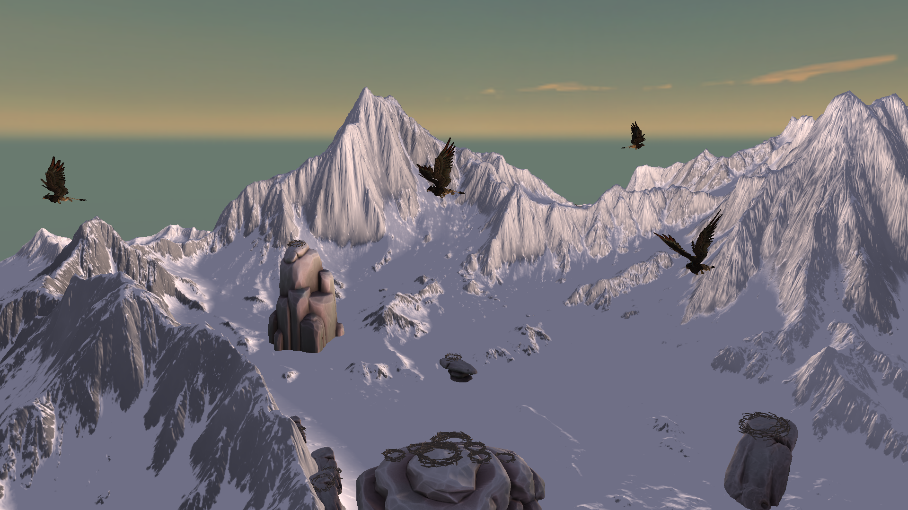
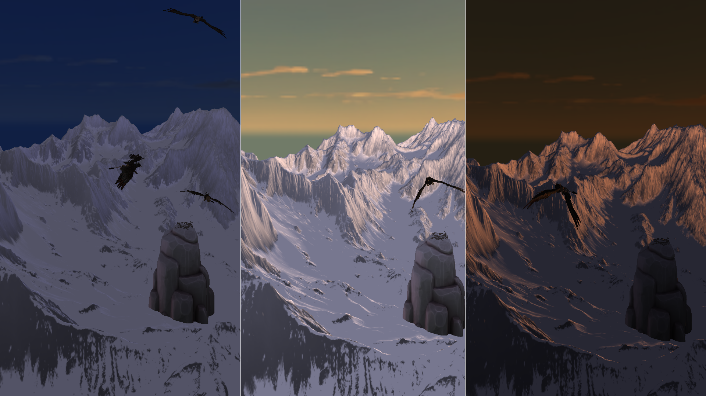
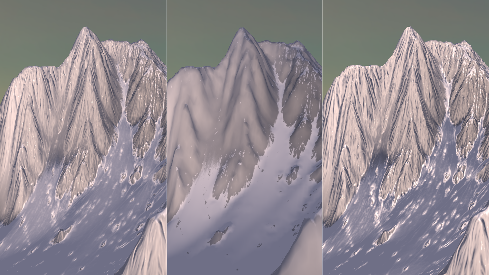
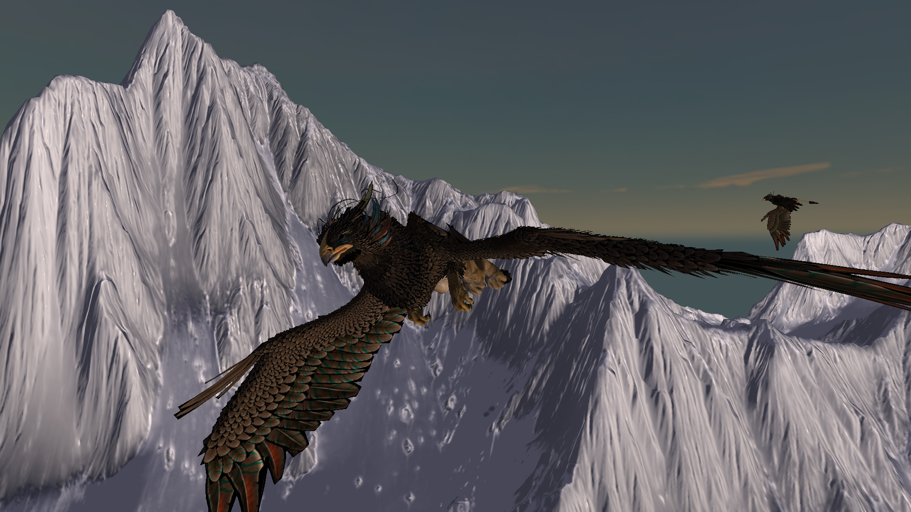
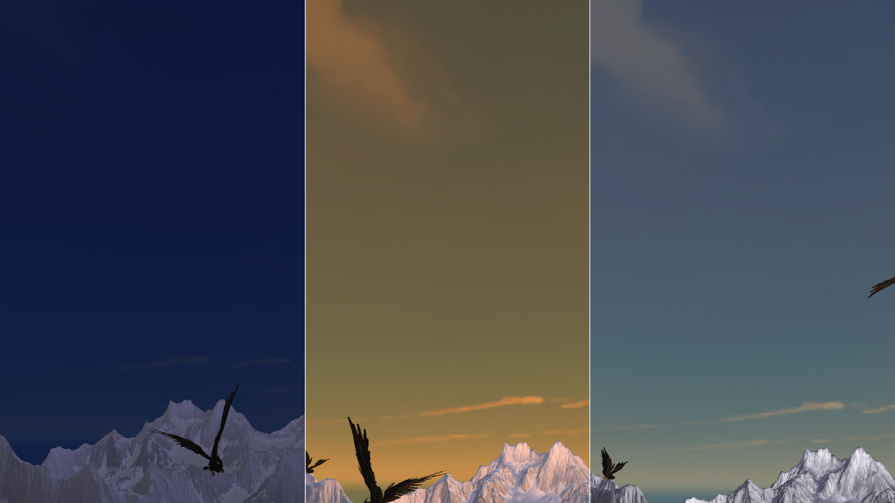
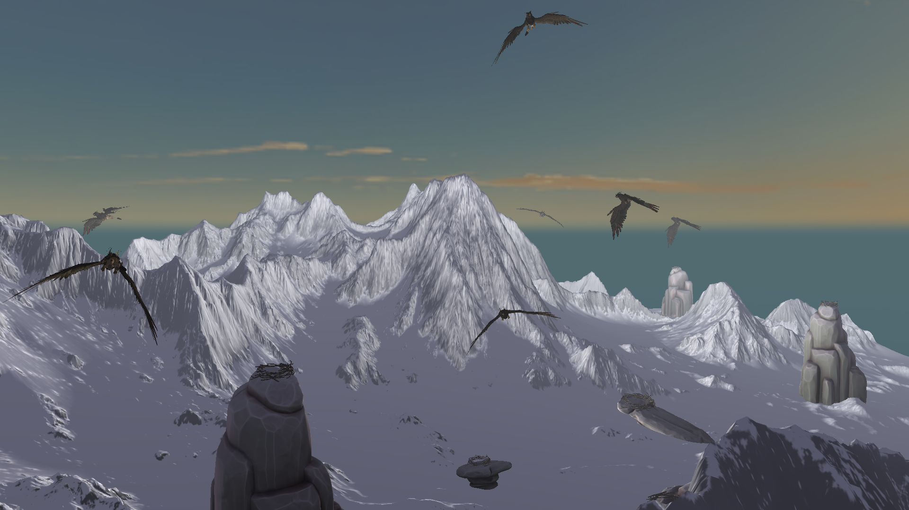

# Real‑Time Mountain Scene with Animated Griffins

The final project code is included in the Assignment 4 Folder

This project implements a mountainous scene featuring animated griffins. The scene uses Blinn‑Phong shading with tangent‑space normal mapping, and a day‑night cycle system for directional lighting sets the colour and position of the light, as well as the colour of the fog and the skybox. A GUI is included to allow the changing of various parameters live in the scene.

Demo video: **https://www.youtube.com/watch?v=HNvmNoOzFQk**

---

## Lighting and Shading

The scene implements a Blinn‑Phong shading model with directional lighting calculated in tangent space to support normal mapping. Normal mapping is implemented in tangent space, with a TBN matrix constructed in the vertex shader using the Gram‑Schmidt process. A controllable `normalMapIntensity` parameter allows runtime adjustment of normal map strength.

The lighting system features a day‑night cycle that transitions light colour, intensity, and position over time. The cycle divides time into four phases—night, dawn, day, and dusk—and smoothly interpolates between predefined colour values. The time‑of‑day value also sets the colour of the fog and the skybox hue.

---

## Materials and Texturing

Material properties (ambient, diffuse, specular, and shininess) are extracted from MTL files and passed to shaders as uniforms. The terrain and griffin models utilize high‑quality diffuse textures with corresponding normal maps to enhance surface detail.

---

## Advanced Features

The project implements nine griffins with hierarchical animations. Each griffin consists of three models with parent‑child relationships, and multiple griffins spawn at different positions with varied flight parameters.

A cube‑mapped skybox provides an immersive environment and is tinted to match lighting conditions based on the time of day.

Fog is calculated per‑fragment in view space, with linear, exponential, and exponential‑squared modes. Fog colour dynamically changes with the day‑night cycle.

The GUI provides controls for the day‑night cycle, fog parameters, normal map intensity, and material editing.

---

## Camera System

The camera implements WASD movement with Q/E for vertical adjustment and mouse‑based rotation. Movement is delta‑time scaled, and the cursor automatically warps to the screen center to enable unlimited rotation.

---

## Assets and References

Models and skybox assets are sourced from Sketchfab and Freestylized. The project uses Assimp, Dear ImGui, and stb_image, with reference to LearnOpenGL tutorials and course notes on fog and texturing.
